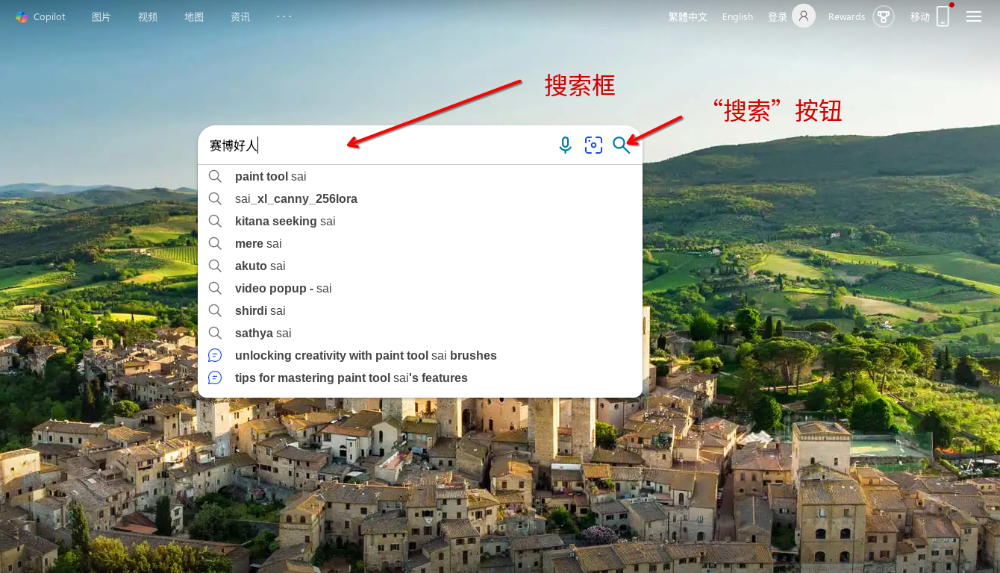
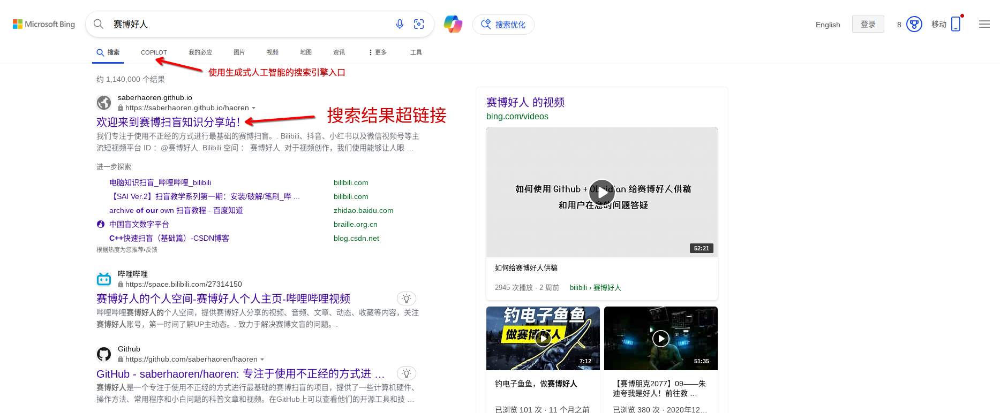

随着互联网的发展，成百上千的网页让人迷失在信息的海洋之中。在茫茫的大海中如何找到属于自己的彼岸，这就需要精通方位的领航员来指引航向。**搜索引擎**就是互联网这个信息大海的领航员，借助它你可以快速地找到包含你所需要的信息的网页，帮助你更快地通过互联网解决你的问题。

**通过向搜索引擎提供需要解决问题的关键词，搜索引擎就会返回和这些问题相关的网页，这其中可能就包含了问题的解答。**
一般而言，搜索引擎会提供一个可供输入的文本框，本文称之为*搜索框(Search Box)*，还有一个*搜索*按钮。当你在搜索框中输入*关键词(Keyword)*并点击搜索按钮后，搜索引擎就会根据你输入的关键词在互联网中找到和这个关键词有关的网页，并将结果以超链接列表的形式陈列。

> [!NOTE]
> 较新的搜索引擎使用了*生成式人工智能(Generative Artificial Intelligence)* 技术，用户可以在搜索框中通过完整的问句向其提问，其回答也将用完整的，人类可以理解的自然语言回答。
> 本篇教程不会涉及这类搜索引擎的使用指引。在掌握本教程后，读者可以自行尝试探索此类搜索引擎的使用。

[附录](#附录常见搜索引擎)列出了常见的搜索引擎。

## 搜索引擎的搜索范围

大部分网页都可以被搜索引擎找到，然而，有些网页可能没有链接指向或者通过技术手段阻止了搜索引擎爬取，例如（列表并非完整）：

 - 没有接入互联网的网站的网页
 - 不允许搜索引擎爬虫访问的网页
 - 不允许一般互联网用户访问的网页，如组织机构的内部网站。
 - 网站服务软件运作不正常而导致无法访问的网页
 - 不使用*超文本传输协议(HTTP)* 或*加密超文本传输协议(HTTPS)* 访问的网页

这些网页无法被搜索引擎的[爬虫](#爬虫是如何工作的)下载并分析，也就无法通过搜索引擎找到。

## 实战:通过搜索引擎找到`赛博好人`网站

第一步，打开浏览器，在地址栏输入`https://www.bing.com`并点击回车按钮。

当出现类似下图所示的界面后（实际界面可能会和教程有所区别），在搜索框中输入`赛博好人`并点击搜索按钮。

点击搜索结果中的第一个超链接，跳转进入`赛博好人`网站。

## 提示

### 商业广告

为了维持运营，搜索引擎会在搜索结果中植入商业广告。为了增加曝光率，这些商业广告会被放在结果靠前的显眼位置，例如搜索结果前排。有些搜索引擎会淡化植入广告和正常搜索结果之间的差距以诱导用户点击商业广告。然而，商业广告指向网站提供的信息也不一定好于其他网站，一些商业广告所指向的网页可能会诱导不必要的消费，有些搜索引擎甚至会推荐包含诈骗内容的商业广告。在使用搜索引擎搜索网页时，必须多加辨别。

## 搜索引擎的历史和原理

一个搜索引擎大致由**爬虫**、**索引器**、**搜索器**三部分组成。*爬虫(Crawler)* 漫游互联网并爬取网页；*索引器(Indexer)* 分析爬取的网页，建立网页内容之间，网页内容和关键词之间的相关性；*搜索器(Searcher)* 接收用户的搜索请求并从索引器提取的网页相关性中找到同用户请求的关键词相关的网页。

### 爬虫是如何工作的？

互联网是由通过*超链接*相互连接的网页交织形成的网络，搜索引擎的爬虫会不断根据网页之间的链接自动化地访问并下载这些网页内容。通过初步分析网页内容，爬虫会从下载的网页中提取出更多超链接。提取出的超链接会被加入爬虫的下载队列。循环往复，搜索引擎的爬虫就通过网页之间的超链接指向自动地高效地在互联互通的网页中漫游走遍了互联网。

### 索引器是如何工作的（建设中）

> 读者真的需要了解PageRank算法才能使用搜索引擎吗？

### 搜索器是如何工作的（建设中）

### 搜索引擎的历史（建设中）

> 留作读者练习。

## 附录：常见搜索引擎

[百度搜索(https://www.baidu.com)](https://www.baidu.com) 是中国大陆最常用的搜索引擎之一。它对中文网页的收录较全，质量较好，可以快速找到日常小问题的答案。

[必应搜索(https://www.bing.com)](https://www.bing.com) 是微软公司开发的搜索引擎。用这个搜索引擎可以找到更好、更专业的网页。

[谷歌搜索(https://www.google.com)](https://www.google.com) 是谷歌公司开发的搜索引擎，已经停止面向中国大陆服务，目前需要[[如何科学上网|科学上网]]才可访问。谷歌搜索是全球技术最强的搜索引擎之一，它的作者之一Larry Page也是目前互联网搜索引擎算法的奠基人之一。Larry Page在斯坦福大学研究生期间发明的PageRank算法如今仍被各大搜索引擎使用。